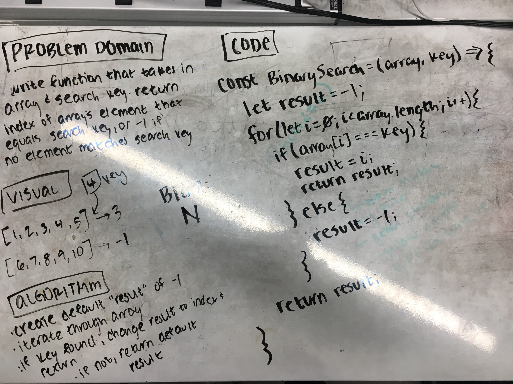

# Binary Search

Take in a sorted array and a search key and perform a binary search and return the index of the array's element that is equal to the search key, or -1 if the search key does not appear in the array.

## Challenge

Do not use any built-in JavaScript methods (e.g. .indexOf)

## Examples

        [1, 4, 7, 9, 10, 65], 10 // => 4

        [1, 4, 7, 9, 10, 65], 9 // => -1

## Solution

** Refactored to actual binary search **
