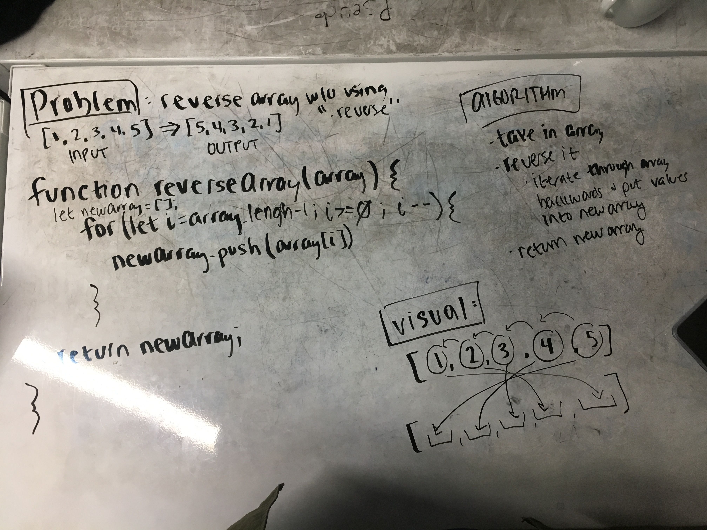

# Reverse an Array

Take in an array as input and return the reverse of the array.

## Challenge

Do not use the built-in JavaScript array method .reverse

## Example

Input:
    
    [1, 2, 3, 4, 5]

Output:

    [5, 4, 3, 2, 1]

## Solution

