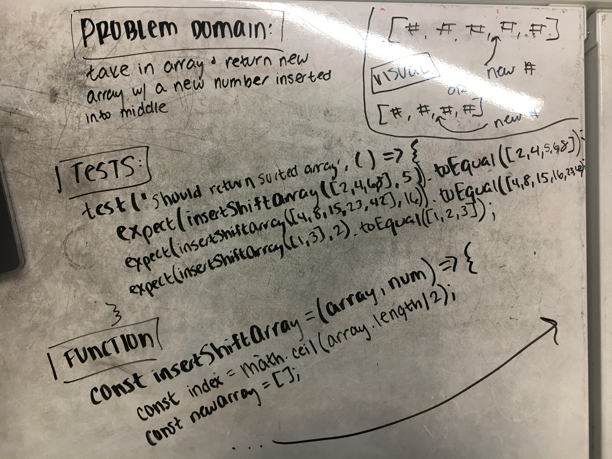
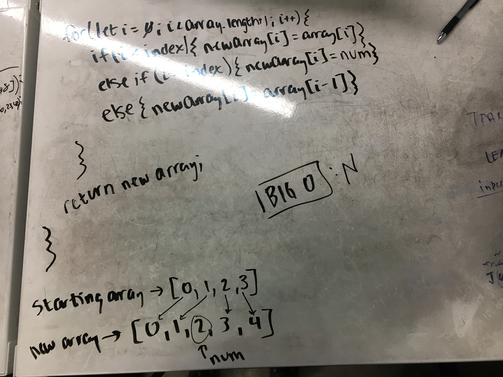

# Shift Array

Take in an array and a number as an input and insert the number at the halfway point in the array (or rounded up from half if length of array is odd).

## Challenge

Cannot use ANY built-in array methods.

## Example
Input:

    [1, 2, 3, 4], 7
    
Output:

    [1, 2, 7, 3, 4]

## Solution

