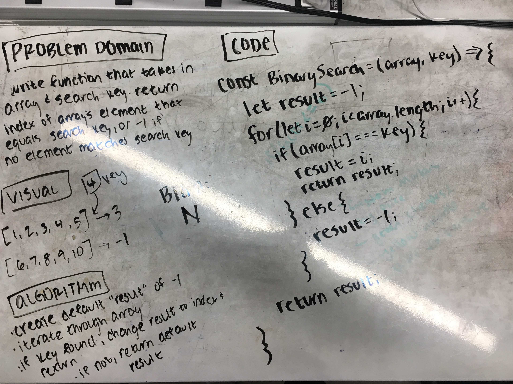

# Binary Search

Take in an array and a search key as an input and return the index of the array's element that is equal to the search key, or -1 if the search key does not appear in the array.

## Challenge

Do not use any built-in JavaScript methods (e.g. .indexOf)

## Solution

