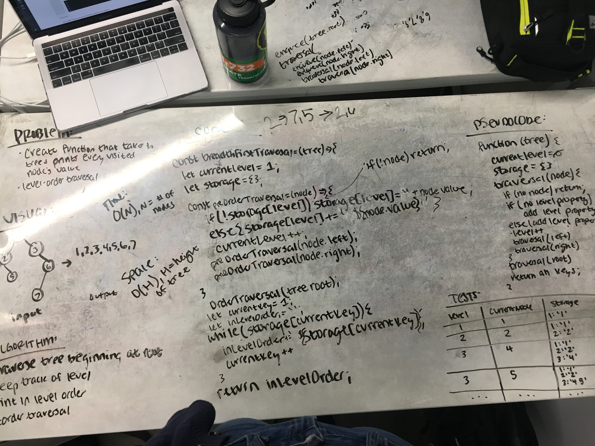

# Breadth-First Traversal

Create a function that takes in a tree and returns all the values in the tree in order of [breadth-first traversal](https://en.wikipedia.org/wiki/Breadth-first_search)

## Challenge

Create most efficient method possible

## Solution

(edited for efficiency)
