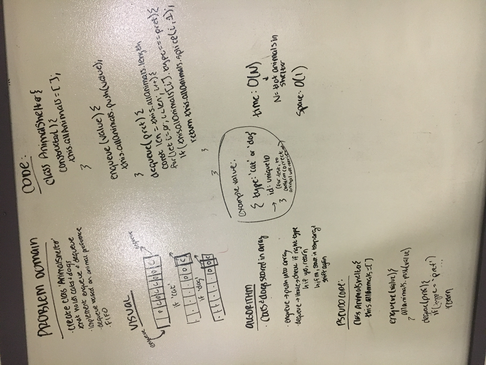

# Fifo Animal Shelter

Create a class AnimalShelter that holds only cats and dogs. AnimalShelter should be a queue (FIFO).

## Challenge

Implement the following methods:
- `enqueue(animal)` : Should take in an animal and add it to the shelter queue.
- `dequeue(preference)`: Should take in optional preference string and return the first animal in the queue of that type (or first animal if no preference stated).

## Solution

