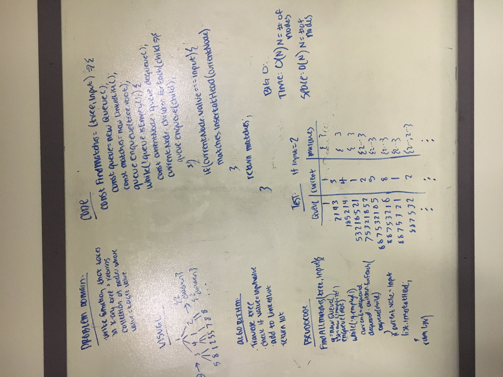

# Find Matches

Write a function that takes in a k-ary tree with non-unique values and a target value, and returns a collection of all nodes with a value matching the target value.

## Challenge

Find the optimal solution.

## Example

Input:

            tree                 number
            
            [1]                     4
           / | \
         [2][4][3]
        / | \   | \
      [8][0][5][2][4]

Output (as array):

    [
        { value: 4, next: null },
        { value: 4, next: null },
    ]

## Solution

