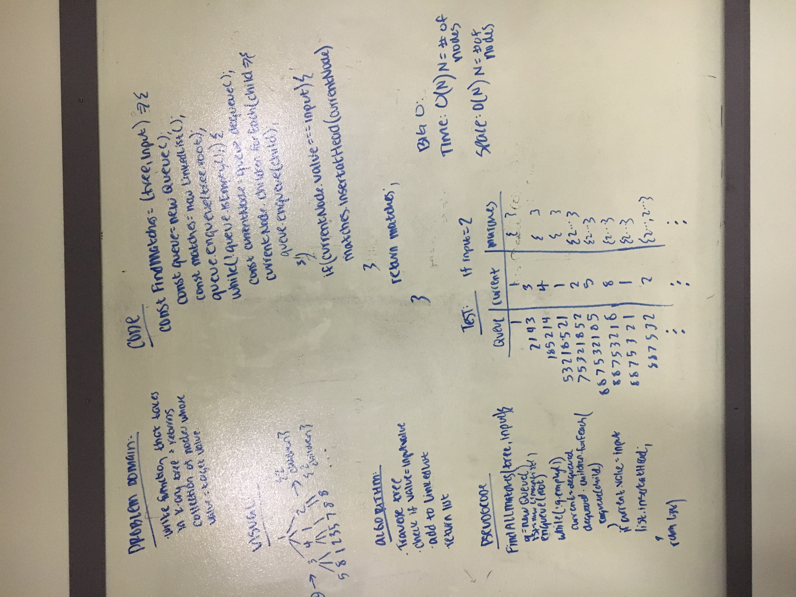

# Find Matches

Write a function that takes in a k-ary tree with non-unique values and a target value, and returns a collection of all nodes with a value matching the target value.

## Challenge

Find the optimal solution.

## Solution

