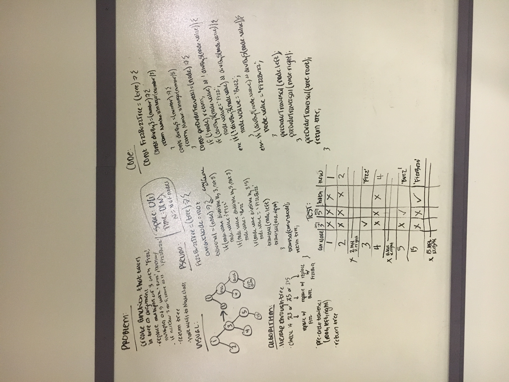

# FizzBuzz Tree

Create a function that takes in a tree and returns a [FizzBuzz](https://en.wikipedia.org/wiki/Fizz_buzz) tree.

## Challenge

Create a function that takes in a tree and manipulates it in the following ways:
- For every multiple of 3, replace the value with 'Fizz'.
- For every multiple of 5, replace the value with 'Buzz'.
- For multiples of 3 and 5, replace the value with 'FizzBuzz'.

Return the new tree.

## Example

Input:
          
           [5]
          /   \
        [3]   [1]
       /   \     \
     [6]   [9]   [15]

Output:

        ['Buzz']
          /   \
     ['Fizz']  [1]
       /   \     \
     [6]   [9] ['FizzBuzz']

## Solution

Edit:
Space: O(H), where H = height of tree because the traversal function creates copies of `node` every time it is called.
