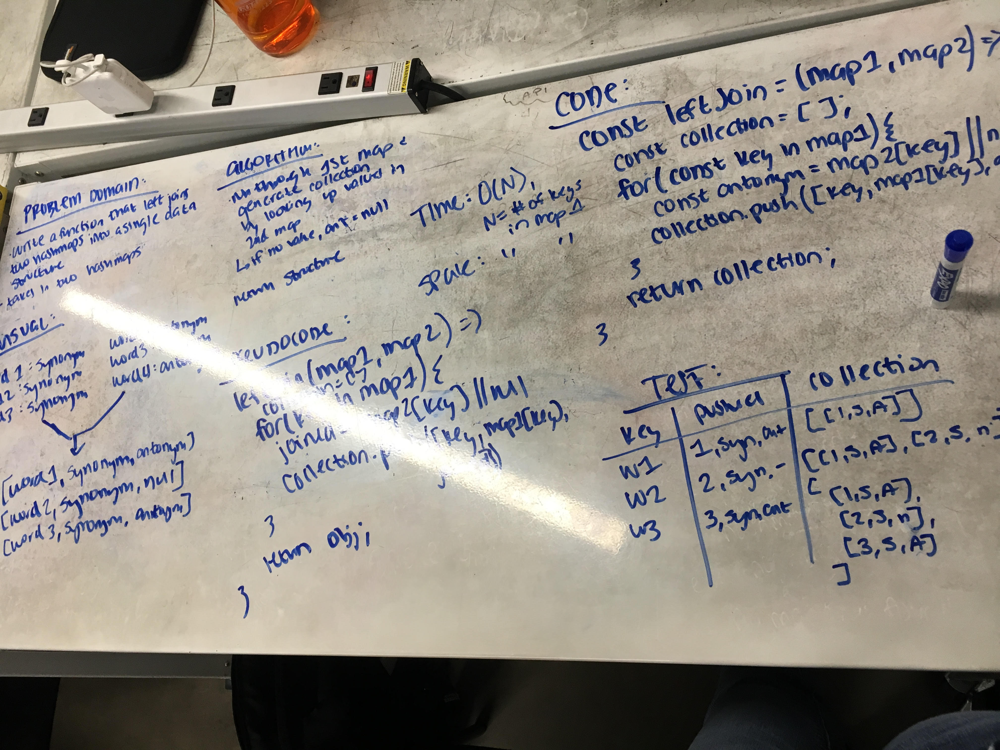

# Left-Join

Write a function that takes in two hashmaps and performs a left-join to make a single data structure.

## Challenge

The first parameter is a hashmap with words as keys and a synonym for the word as its value. The second parameter is a hashmap with words as keys and an antonym for the word as its value.

LEFT JOIN: All values in the first hashmap are returned. If values for the keys in the first map exist in the second map, those values are also returned. If keys in the first map do not exist in the second map, the 'antonym' value should return as `null`.

## Example

Input:

    {                               {
        fond: 'enamored',               fond: 'averse',
        wrath: 'anger',                 wrath: 'delight',
        diligent: 'employed',           diligent: 'idle',
        outfit: 'garb',                 guide: 'follow',
        guide: 'usher',                 flow: 'jam',
    }                               }
    
Output:

    [
        ['fond', 'enamored', 'averse'],
        ['wrath', 'anger', 'delight'],
        ['diligent', 'employed', 'idle'],
        ['outfit', 'garb', null],
        ['guide', 'usher', 'follow'],
    ]

## Solution

