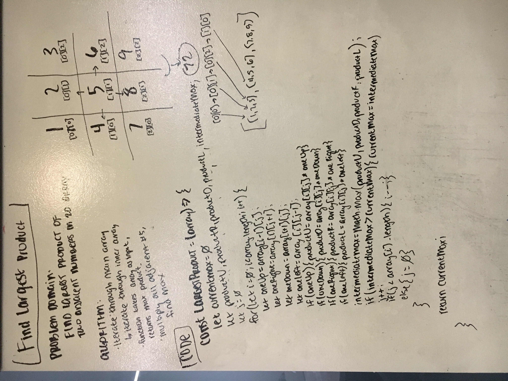

# Largest Product

Take in a 2D array as an input and return the largest product of any two adjacents numbers in the array.

## Challenge

Do not use any built-in JavaScript methods.

## Example

Input:

    [
        [1, 2, 3],
        [4, 5, 6],
        [7, 8, 9],
    ]

Output:

    72

## Solution

Not pictured: O(N*array[i].length)
