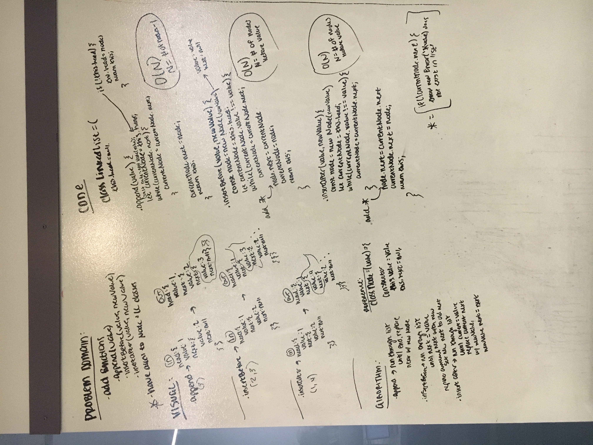

# Linked List Insertions

Create prototypes on the LinkedListWithTail (LL) class.

## Challenge

Create prototypes:  
    - `.append(value)` : Should add node with specified value to end of LL 
    - `.insertBefore(value, newValue)` : Should add newValue node before node with specified value.  
    - `.insertAfter(value, newValue)` : Should add newValue node after node with specified value.

## Examples

#### .append(value)
    
    head->[1]->[2]->[3]  =>  list.append(9)  =>  head->[1]->[2]->[3]->[9]

#### .insertBefore(value, newValue)
    
    head->[1]->[2]->[3]  =>  list.insertBefore(2, 9)  =>  head->[1]->[9]->[2]->[3]

#### .insertAfter(value, newValue)
    
    head->[1]->[2]->[3]  =>  list.insertAfter(2, 9)  =>  head->[1]->[2]->[9]->[3]
   
## Solution

