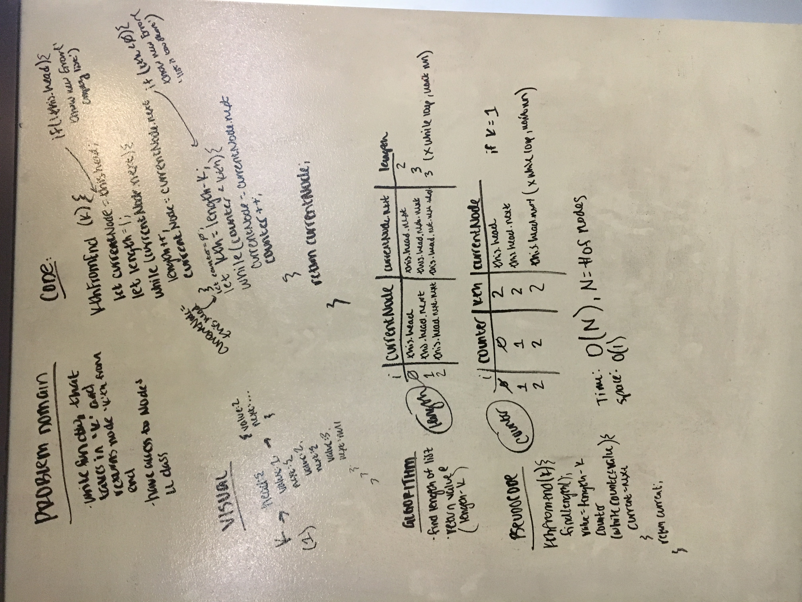

# Linked List Insertions

Create prototype on the LinkedList class that will return the node 'kth' from the end.

## Challenge

LinkedList and Node classes are available, as are all previously defined methods, however no previous methods can be modified.
- `kthFromEnd(k)` : Takes in number 'k' which denotes the index (from the end) of node to return.

    
## Solution

