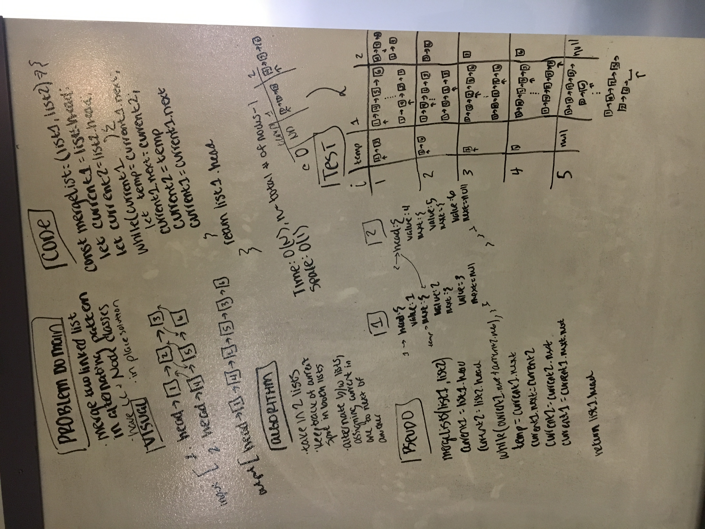

# Linked List Merge

Create a function that merges two Linked Lists together

## Challenge

Create a function that takes in two linked lists as parameters and returns a single linked list created by 'zippering' the two lists together. The function should operate in place, O(1) in space.

-EXAMPLE-  
Inputs:  
`list1 = head->[1]->[1]->[1]`  
`list2 = head->[2]->[2]->[2]`  
Output:  
`list1 = head->[1]->[2]->[1]->[2]->[1]->[2]`  

## Solution

