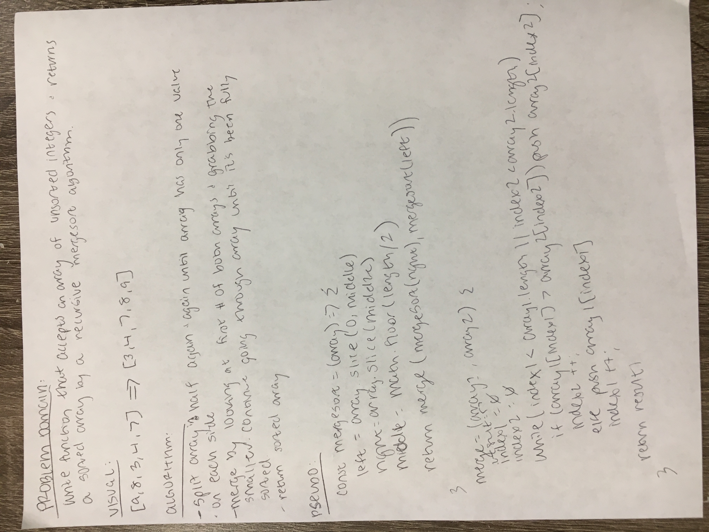
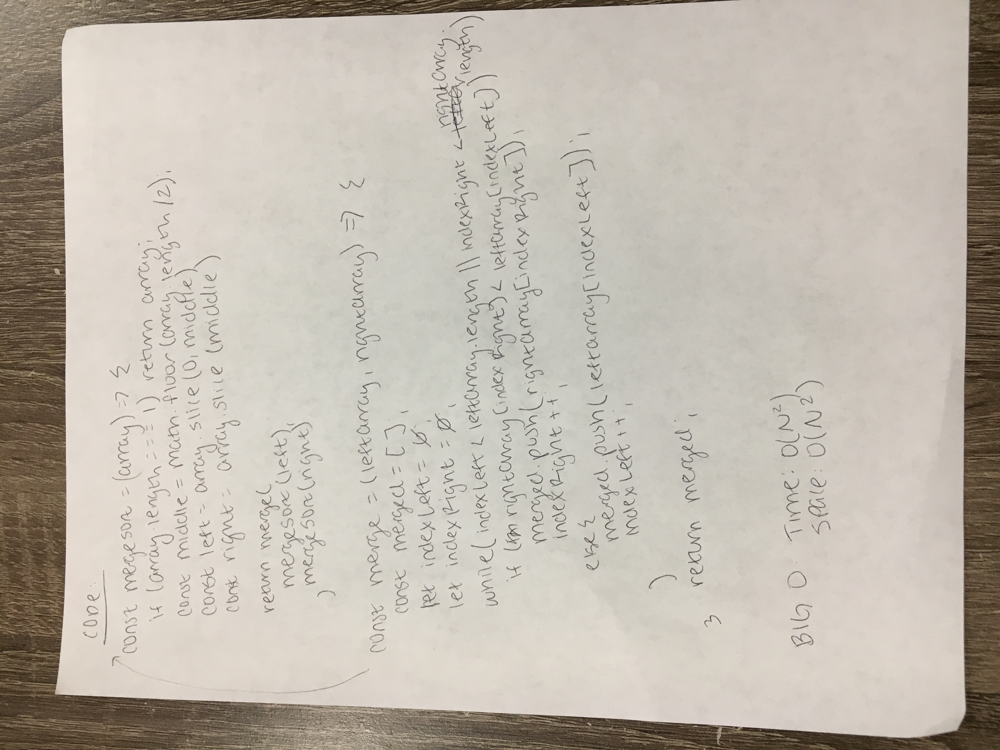

# Merge sort

Write a function that takes an a single unsorted array of integers and returns a sorted array.

## Challenge

Perform a [merge sort](https://en.wikipedia.org/wiki/Merge_sort) on the array.

## Example

Input:

    [8, 4324, -4, 12]
    
Output:

    [-4, 8, 12, 4324]

## Solution

