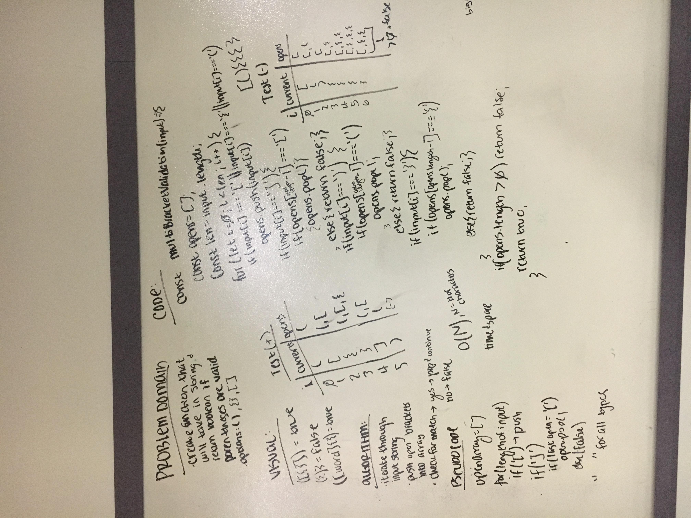

# Multi-Bracket Validation

Create a function that takes in a string as an input and returns a boolean true/false.

## Challenge

In the function, validate that the brackets are in correct order, where no outer bracket will close before a nested one, and each opening brace has a closing brace (and vice versa).

## Examples

    [{()}]          //=>  true
    []{}()          //=>  true
    [{word}]()()    //=>  true
    {{}]}           //=>  false
    [({)}word]      //=>  false

## Solution

