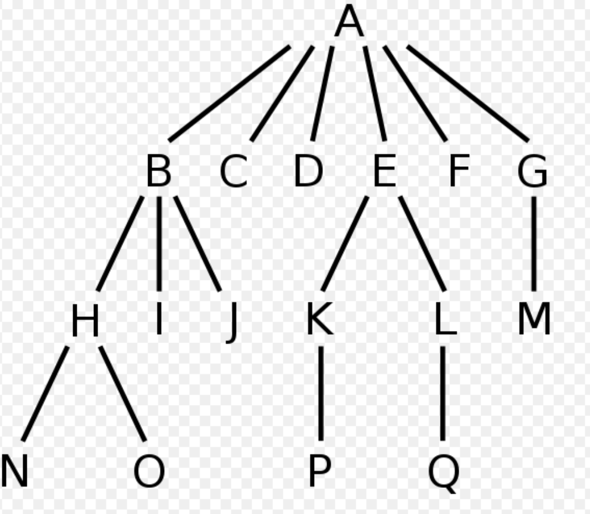
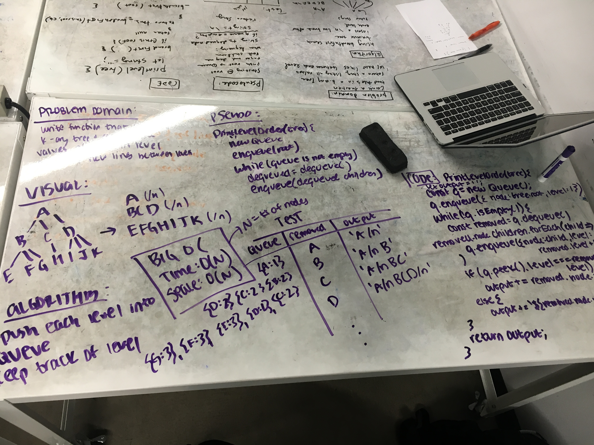

# Print Level Order

Create a function that takes in a tree and returns a string of all tree values in breadth-first order with new lines between levels.

## Challenge

Have access to all classes and methods.

Write at least 3 test assertions to test function.

## Example
Input:

Output:

        A 
        B C D E F G 
        H I J K L M 
        N O P Q
        
## Solution

