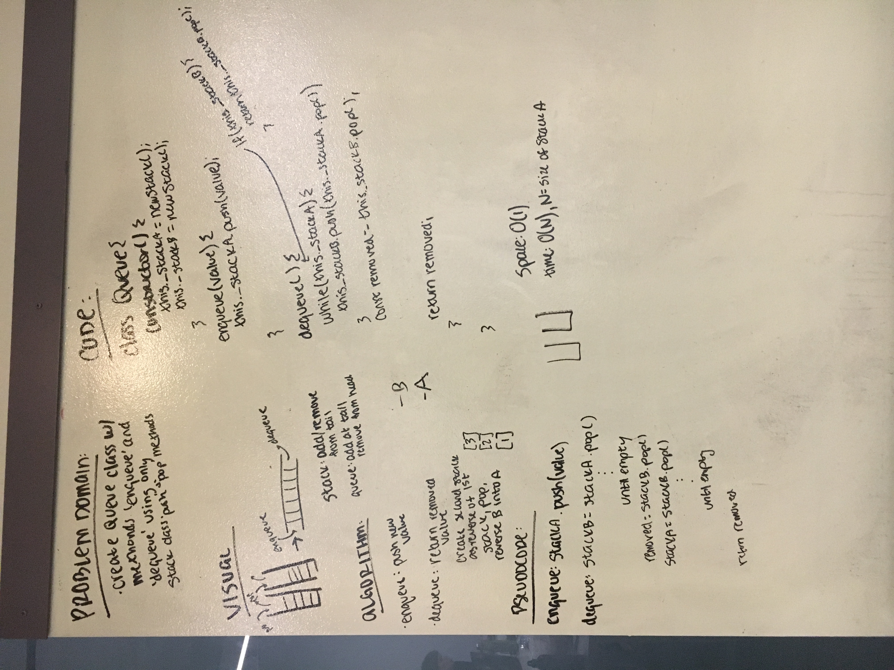

# Queue with Stacks

Create Queue class using only methods available in previously-created Stack class.

## Challenge

Create methods Queue.enqueue(value) and Queue.dequeue() using only Stack.push(value) and Stack.pop().

Perform FIFO using only LIFO methods.

## Solution

