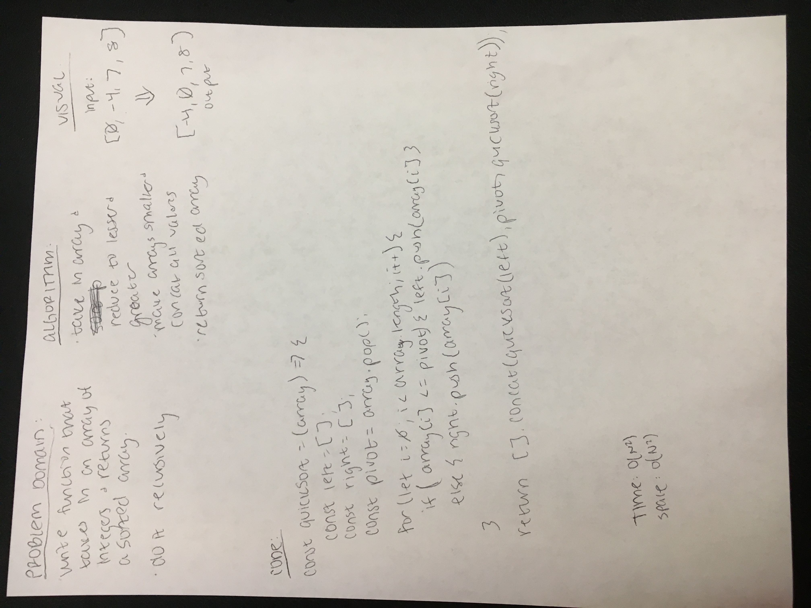

# Quick sort

Write a function that takes in a single unsorted array of integers and returns a sorted array.

  ## Challenge

Perform a recursive [quick sort](https://en.wikipedia.org/wiki/Quicksort) on the array.

## Example

Input:

    [8, 4324, -4, 12]

Output:

    [-4, 8, 12, 4324]

## Solution

