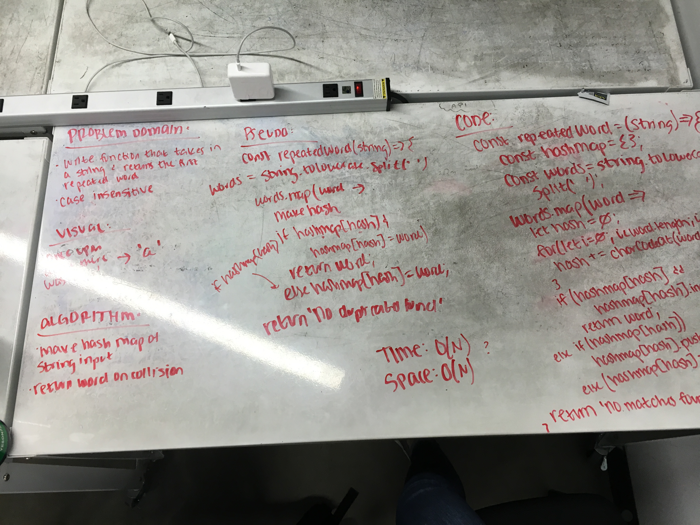

# Repeated Word

Write a function that accepts a string and returns the first repeated word in the string.

## Challenge

Function is case-insensitive and should be done in O(N) time or less. All built-in functions are available.

## Example

Input:

    "It was the best of times, it was the worst of times..."
    
Output:

    'it'

## Solution

