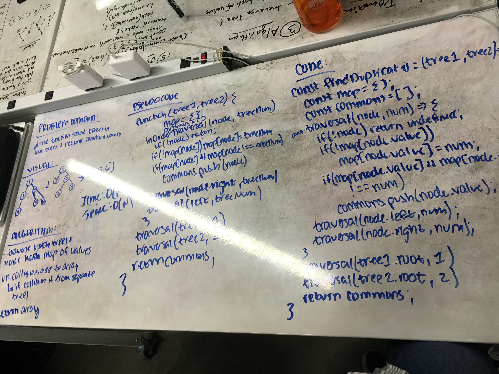

# Tree Intersections

Create a function that takes in two trees and returns a collection of all values present in both trees.

## Challenge

Perform the function in O(N) time.

## Example

Input:

          tree1                    tree2
          
           [1]                      [4]
          /   \                    /   \
        [2]   [3]                [3]   [1]
             /   \              /   \     \
           [4]   [5]          [6]   [9]   [2]
Output:

    [4, 3, 1, 2]

## Solution

