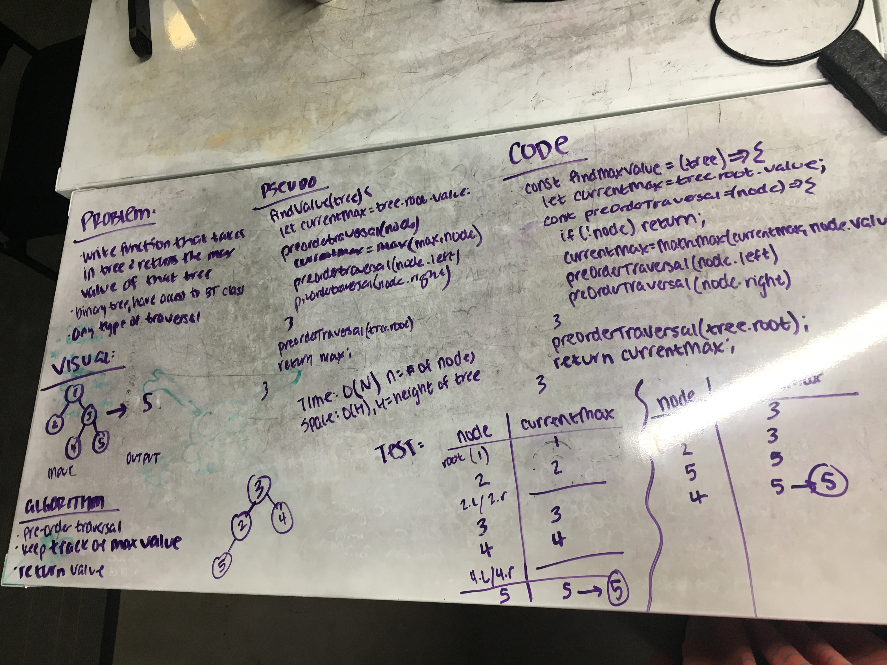

# Find Maximum Value

Create a function that takes in a binary tree and returns the maximum value in that tree.

## Challenge

Function must be O(n) or better in time and O(h) or better in space, where n = number of nodes in the tree, and h = height of the tree.

## Example

Input
          
           [4]
          /   \
        [3]   [1]
       /   \     \
     [6]   [9]   [2]
     
Output:

    9

## Solution

